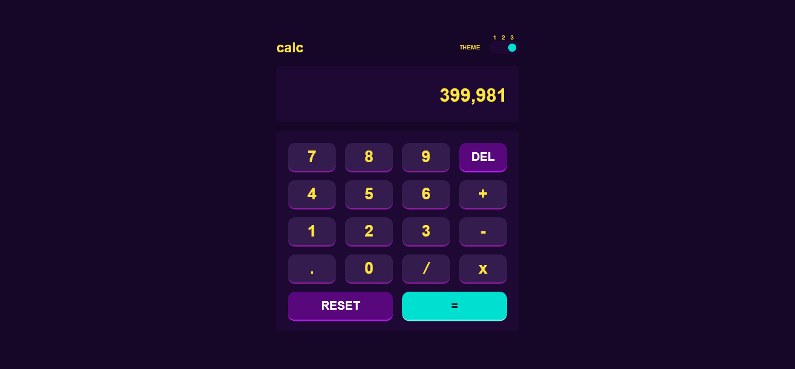

# Frontend Mentor - Calculator app solution

This is a solution to the [Calculator app challenge on Frontend Mentor](https://www.frontendmentor.io/challenges/calculator-app-9lteq5N29). Frontend Mentor challenges help you improve your coding skills by building realistic projects. 

## Table of contents

- [Overview](#overview)
  - [The challenge](#the-challenge)
  - [Screenshot](#screenshot)
  - [Links](#links)
- [My process](#my-process)
  - [Built with](#built-with)
  - [What I learned](#what-i-learned)
  - [Useful resources](#useful-resources)

## Overview

### The challenge

Users should be able to:

- See the size of the elements adjust based on their device's screen size
- Perform mathmatical operations like addition, subtraction, multiplication, and division
- Adjust the color theme based on their preference
- **Bonus**: Have their initial theme preference checked using `prefers-color-scheme` and have any additional changes saved in the browser

### Screenshot



### Links

- Solution URL: [Solution URL](https://github.com/comfortprince/frontend-mentor-5-calculator-app)
- Live Site URL: [Live Site URL](https://comfortprince.github.io/frontend-mentor-5-calculator-app/src/)

## My process

### Built with

- Tailwindcss
- Data Attributes
- Flexbox
- Vanilla JS

### What I learned

One of the key concepts I learned during the course of this challenge was how to configure tailwindcss to my specific needs. I learned how to configure color, font-size,
width, height etc. The real game changer was discovering how to configure data attributes in tailwind. It simplified my implementation of theme selection.
```js
const plugin = require('tailwindcss/plugin')

module.exports = {
  content: ["./src/**/*.{html,js}"],
  theme: {
    colors: {
      // Theme Colors
    },
    extend: {
      fontSize : {
        "xxs" : "0.3rem"
      },
      width : {
        "1.75" : "0.4375rem",
        "key-shadow-width" : "3px"
      },
      height : {
        "1.75" : "0.4375rem"
      },
    },
  },
  plugins: [
    plugin(({ addVariant }) => {
      addVariant('theme-1', '&[data-theme="theme-1"]')
      addVariant('theme-2', '&[data-theme="theme-2"]')
      addVariant('theme-3', '&[data-theme="theme-3"]')
    })
  ],
}
```

### Useful resources

- [Stake Overflow](https://www.stakeoverflow.com)
